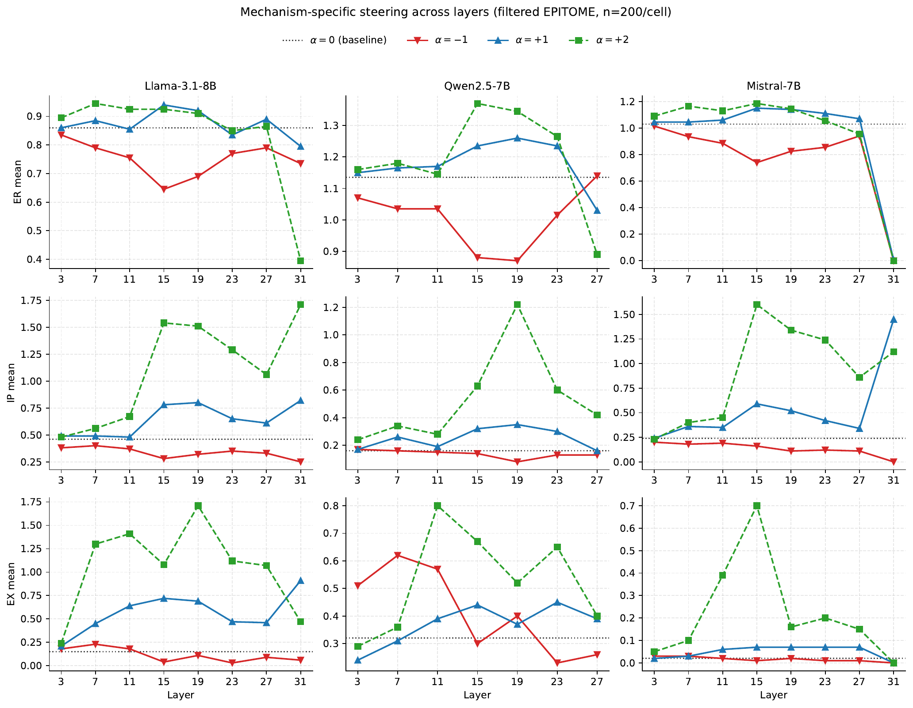

# Empathy Is Steerable but Multi-Axial

Official repository for **"Empathy Is Steerable but Multi-Axial: Mechanism
Geometry and Persona Effects in LLMs,"** accepted to the **EMNLP 2026 Main
Conference**.

> **Release status:** The camera-ready artifact release is in progress. The
> cleaned code, environment specification, run scripts, and reproducibility
> instructions will be added before the final release.

## Overview

This work studies supportive empathy as operationalized by the EPITOME
framework. EPITOME separates supportive responses into three communication
dimensions:

- **ER (Emotional Reactions):** acknowledging the seeker's emotions.
- **IP (Interpretations):** communicating an understanding of the seeker's
  experience.
- **EX (Explorations):** inviting the seeker to elaborate.

We use Contrastive Activation Addition (CAA) to extract a candidate activation
direction for each dimension and test its target and off-target effects across
three instruction-tuned language models:

- Llama-3.1-8B-Instruct
- Qwen2.5-7B-Instruct
- Mistral-7B-Instruct

## Steering Overview

<p align="center">
  
</p>

<p align="center"><em>
The same seeker post produces different response changes when steering the ER,
EX, or IP direction at layer 15.
</em></p>

## Main Findings

1. **EPITOME scores are steerable.** Layer 15 provides the most consistent
   intervention point across the three models and three dimensions in our
   layer sweep.
2. **The recovered directions are only partly selective.** Steering one
   EPITOME dimension can also change non-target dimensions.
3. **Persona effects are weakly captured by the recovered basis.** At layer
   15, the ER/IP/EX subspace captures 2.6--3.1% of persona-mean squared
   activation-shift magnitude across models.

These findings concern activation directions associated with EPITOME-defined
supportive-empathy dimensions. They should not be interpreted as evidence for
a universal linear representation of empathy or as a substitute for human
evaluation of perceived empathy.

### Layer-wise Steering

<p align="center">
  
</p>

<p align="center"><em>
Target scores across layers and intervention strengths. Layer 15 is the most
consistent shared operating point across the three models and dimensions.
</em></p>

### Persona-induced Shifts

<p align="center">
  
</p>

<p align="center"><em>
The ER/IP/EX subspace captures only 2.6--3.1% of persona-mean squared
activation-shift magnitude at layer 15; most persona-induced displacement lies
in the residual subspace.
</em></p>

## Repository Structure

```text
src/       Experiment and evaluation entry points
scripts/   Reproduction and analysis pipelines
latex/     Paper source and figures
docs/      Experiment notes and supporting documentation
assets/    Images used in this README
```

The public release will include a mapping from the paper's experiments and
tables to their corresponding commands and output schemas.

## Data

The experiments use the EPITOME mental-health support data and, for the
out-of-domain analysis, EmpatheticDialogues. Source dialogue text is not
redistributed in this repository. Dataset acquisition and split-reconstruction
instructions will be provided subject to the original datasets' licenses.

## Reproducibility

The final artifact will provide:

- environment and dependency specifications;
- vector extraction and activation-steering scripts;
- EPITOME and LLM-judge evaluation pipelines;
- layer-sweep, persona, residualization, and robustness analyses; and
- commands and metadata needed to reconstruct the reported splits.

## Citation

The ACL Anthology citation will be added after publication.

## Authors

- JuHeon Ha
- Byounghan Lee
- Yunseo Choi
- Kyung-Ah Sohn

## License

Code and data-release terms will be specified with the artifact release. The
original datasets remain subject to their respective licenses.
