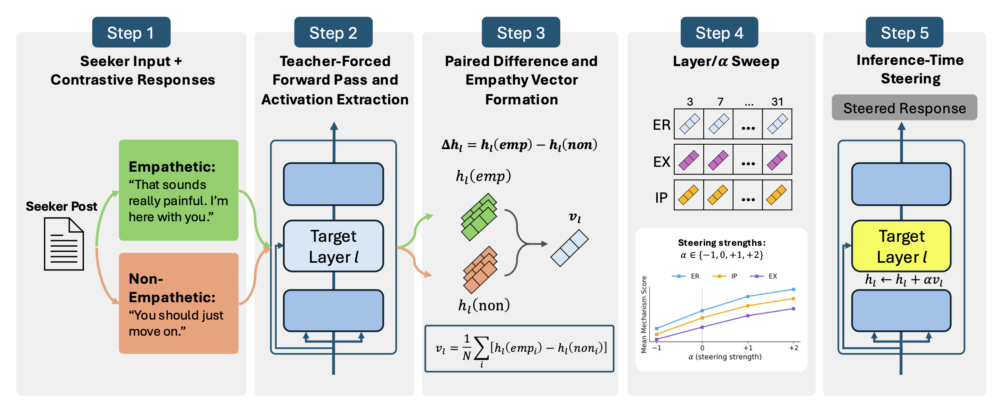
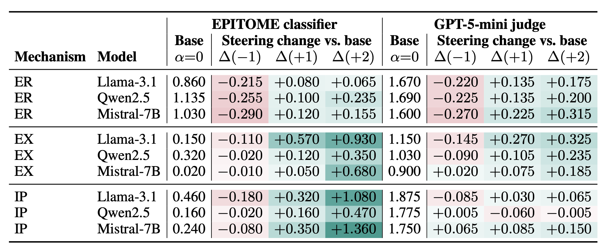
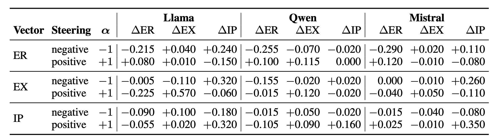
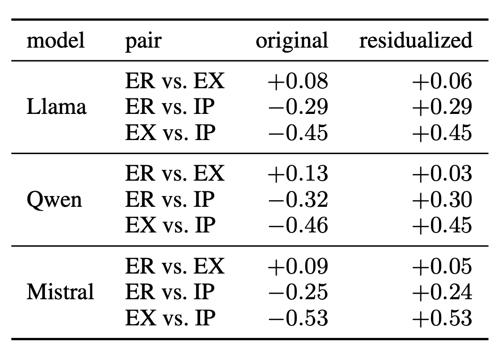
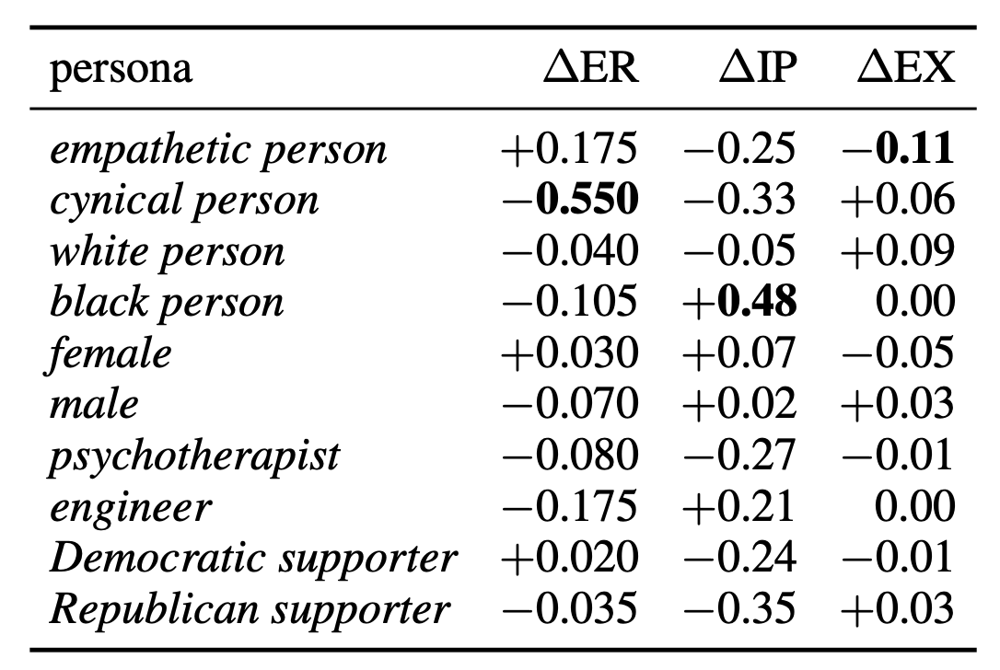
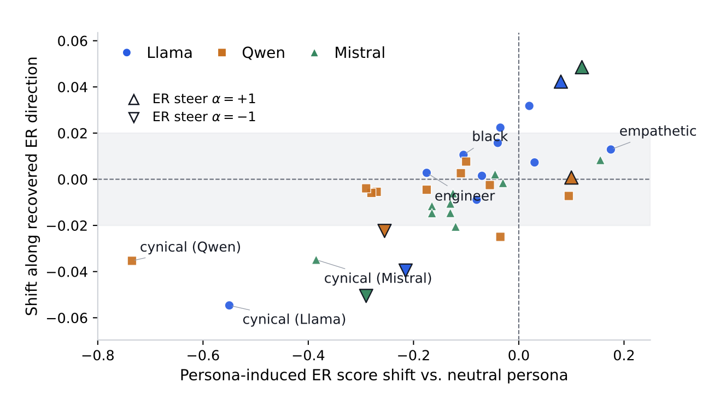
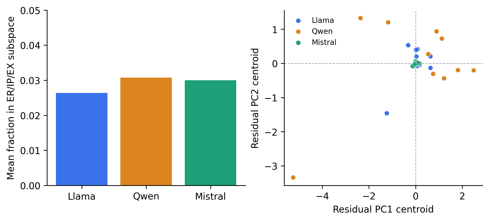
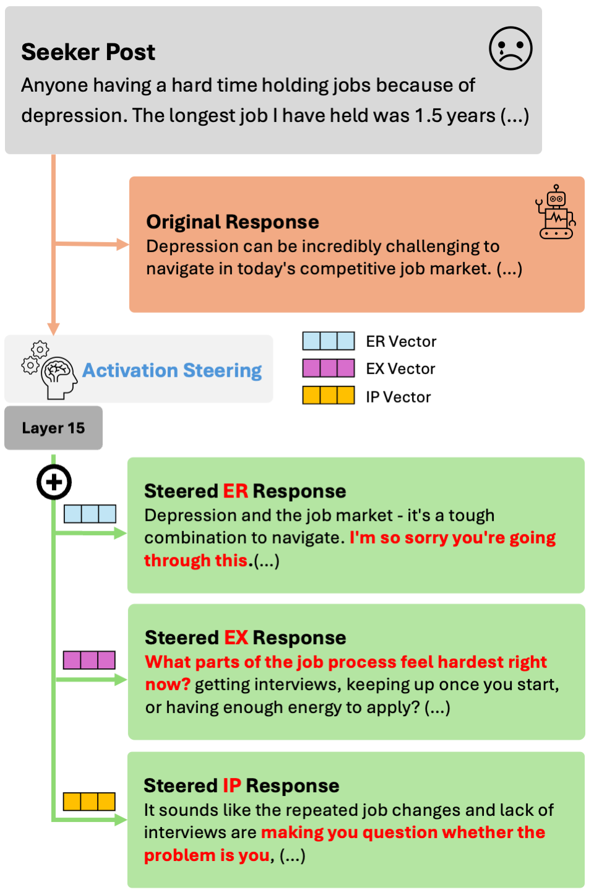

# Empathy Is Steerable but Multi-Axial

Official repository for **"Empathy Is Steerable but Multi-Axial: Mechanism
Geometry and Persona Effects in LLMs,"** accepted to the **EMNLP 2026 Main
Conference**.

[Paper (PDF)](Empathy_Is_Steerable_But_Multi_Axial__Mechanism_Geometry_and_Persona_Effects_in_LLM_camera.pdf)
&nbsp;&nbsp;|&nbsp;&nbsp;
[Reproducibility Guide](REPRODUCIBILITY.md)
&nbsp;&nbsp;|&nbsp;&nbsp;
[Project Page](https://hjhj97.github.io/Empathy-Is-Steerable-but-Multi-Axial/)

## Overview

Activation steering can control behaviors such as honesty, refusal, and
sycophancy, but supportive empathy is evaluated along multiple dimensions that
may not correspond to independently controllable activation directions. We use
the EPITOME framework to study three dimensions of supportive empathy:

- **ER (Emotional Reactions):** acknowledging the seeker's emotions;
- **IP (Interpretations):** communicating an understanding of the seeker's
  experience; and
- **EX (Explorations):** inviting the seeker to elaborate.

Using Contrastive Activation Addition (CAA), we derive one candidate direction
for each dimension and test its target and non-target effects in
Llama-3.1-8B-Instruct, Qwen2.5-7B-Instruct, and Mistral-7B-Instruct.

<p align="center">
  
</p>

<p align="center"><em>
We construct contrastive response pools, extract teacher-forced residual-stream
activations, form a mean-difference vector for each EPITOME dimension, sweep
layers and steering strengths, and add the selected vector during generation.
</em></p>

## Main Findings

### 1. EPITOME proxy scores are steerable across models

Layer 15 provides a consistent shared intervention point. At
`alpha = +1`, each ER, IP, and EX vector increases its corresponding target
score across all three model families. The GPT-5-mini judge preserves the ER
and EX directional patterns, while agreement is weaker for IP.

<p align="center">
  
</p>

<p align="center"><em>
Layer-15 target scores under mechanism-specific steering. Values report the
change from the matching unsteered baseline.
</em></p>

### 2. Target steerability does not imply selective control

The recovered directions are only partly separable. Each vector moves its
target score in the expected direction, but steering one dimension can also
shift the other two. EX steering shows the clearest shared pattern: positive EX
steering raises EX while reducing ER and IP across all three models.

<p align="center">
  
</p>

The vector geometry is consistent across models: ER and EX are nearly
orthogonal, while ER-IP and EX-IP are anti-aligned. Residualizing each vector
against the other two changes this geometry and weakens parts of the EX and IP
steering effects, showing that shared components contribute to behavior.

<p align="center">
  
</p>

### 3. Persona-conditioned shifts are not captured by a single direction

Persona prompts substantially change ER and IP scores while leaving EX
comparatively stable. These patterns are model-dependent and are treated as
properties of the evaluated models under the specified prompts, not as
properties of the referenced social groups.

<p align="center">
  
</p>

Persona-induced ER changes align only weakly with movement along the recovered
ER direction. Direct ER-steering controls move the score and projection
together more clearly, whereas persona prompts can produce large score changes
with little movement along that direction.

<p align="center">
  
</p>

More broadly, the full ER/IP/EX subspace captures only **2.6-3.1%** of
persona-mean squared activation-shift magnitude at layer 15. Most
persona-induced displacement therefore lies outside the recovered mechanism
basis.

<p align="center">
  
</p>

## Qualitative Example

<p align="center">
  
</p>

<p align="center"><em>
For the same seeker post, ER steering adds emotional acknowledgment, IP
steering adds an interpretation, and EX steering adds a follow-up question.
The quantitative results above show that these target changes are not fully
isolated from the other dimensions.
</em></p>

## Scope

The results concern activation directions associated with **EPITOME-defined
supportive empathy in peer-support dialogue**. They do not establish a complete
or universal linear representation of empathy. The reported effects are based
on automated proxy scores; human evaluation is needed to determine whether the
changes improve perceived empathic support.

## Repository Structure

```text
src/        Experiment and evaluation entry points
scripts/    Reproduction and analysis pipelines
artifacts/  Aggregate, text-free results used to audit paper values
patches/    Compatibility patch for the EPITOME classifiers
assets/     Figures and tables used in this README
docs/       Rebuttal, camera-ready notes, and project-page sources
```

## Reproducibility

The repository provides:

- environment and dependency specifications;
- data preparation and deterministic split construction;
- vector extraction and activation-steering scripts;
- EPITOME and LLM-judge evaluation pipelines;
- layer-sweep, persona, residualization, and robustness analyses; and
- aggregate artifacts corresponding to the reported paper values.

Source dialogue text, full model generations, activation tensors, model
weights, and checkpoints are not redistributed. Dataset acquisition and
experiment commands are documented in
[`REPRODUCIBILITY.md`](REPRODUCIBILITY.md).

## Citation

The ACL Anthology citation will be added after publication.

## Authors

- JuHeon Ha
- Byounghan Lee
- Yunseo Choi
- Kyung-Ah Sohn

## License

The original code in this repository is released under the MIT License. The
datasets, model weights, and third-party repositories remain subject to their
respective licenses and terms. The compatibility patch under `patches/` does
not grant rights to the upstream EPITOME source code.
